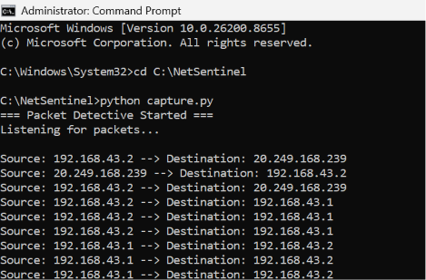

# SOC-Networking-Level1
Beginner SOC project using Python and Scapy to capture live network packets and analyze IP communication.
# 🌐 Beginning My SOC Journey | Level 1: Networking Basics

## 🧪 Project Overview
This is my first hands-on project in Networking and Cybersecurity as part of my SOC (Security Operations Center) learning journey.

I built a simple Python-based packet sniffer using **Scapy** that captures live network traffic and displays source and destination IP addresses in real time.

---

## ⚙️ Tools Used
- Python 🐍
- Scapy 📡
- Networking Concepts 🌐

---

## 🧠 What I Learned
- Private IP vs Public IP
- How devices communicate over a network
- Basics of packet capture and traffic monitoring
- Introduction to NAT (Network Address Translation)
- Real-time network packet analysis using Python

---

## 💻 Project Description
This project captures live network packets from my system and extracts important information like:
- Source IP Address
- Destination IP Address

It helped me understand how real network traffic flows between devices and external servers.

---

## 📸 Screenshot

---
## 🐍 Code File
capture.py contains the packet sniffing logic using Scapy.

---

## 🚀 Outcome
This project helped me connect theoretical networking concepts with real-world traffic analysis. It marks the beginning of my journey into SOC Analysis and Blue Team cybersecurity roles.

---

## 🔮 Future Goals
- Learn Wireshark in depth
- Build advanced packet analyzer tools
- Understand intrusion detection systems
- Work on real SOC simulation projects

---

## 🏷️ Tags
#SOCJourney #CyberSecurity #Networking #Python #Scapy #BlueTeam #InfoSec #LearningInPublic
